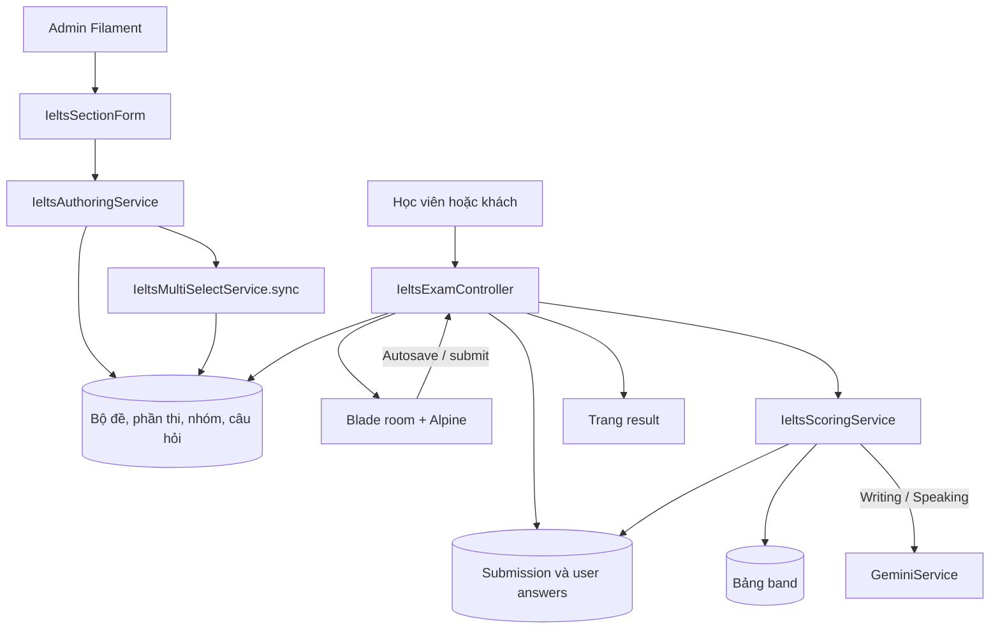
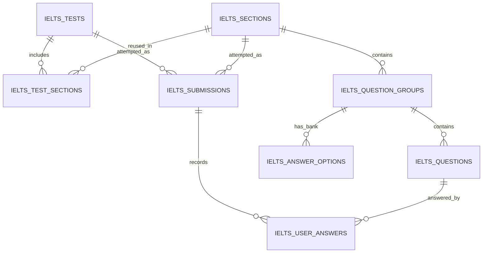

# IELTS Simulator

Tài liệu chức năng và kỹ thuật của module giả lập thi IELTS trong Vocafy.

**Cập nhật:** 02/10/2026. **Branch:** `feature/IELTS-Simulator-System-Blueprint`. **Nguồn:** WSL `/home/tram/Study/Vocafy`, HEAD `761e76d` và toàn bộ thay đổi chưa commit tại thời điểm rà soát. Chưa coi là bản phát hành đã nghiệm thu.

## Mục lục

1. [Phạm vi và trạng thái](#1-phạm-vi-và-trạng-thái)
2. [Kiến trúc và bản đồ mã nguồn](#2-kiến-trúc-và-bản-đồ-mã-nguồn)
3. [Mô hình dữ liệu](#3-mô-hình-dữ-liệu)
4. [Luồng biên tập và xuất bản](#4-luồng-biên-tập-và-xuất-bản)
5. [Luồng làm bài](#5-luồng-làm-bài)
6. [Routes và payload](#6-routes-và-payload)
7. [Chấm điểm](#7-chấm-điểm)
8. [Listening và media](#8-listening-và-media)
9. [Tương thích dữ liệu cũ](#9-tương-thích-dữ-liệu-cũ)
10. [Thiết lập và dữ liệu mẫu](#10-thiết-lập-và-dữ-liệu-mẫu)
11. [Hướng dẫn bảo trì và mở rộng](#11-hướng-dẫn-bảo-trì-và-mở-rộng)

Tài liệu đi kèm:

- **[Hướng dẫn admin](ADMIN-GUIDE.md):** tạo phần thi, nhập từng dạng, câu chọn nhiều, kéo thả, bản đồ, audio và xuất bản.
- **[Trạng thái dạng câu hỏi](QUESTION-TYPES.md):** ma trận hỗ trợ và các kịch bản cần nghiệm thu.
- **[Báo cáo rà soát](AUDIT.md):** lỗi đã xác nhận, phần nghiệp vụ còn thiếu, bằng chứng và thứ tự P1/P2/P3.

Các đường dẫn mã nguồn bên dưới tính từ root repository. Tài liệu mô tả hành vi của project, không xác nhận tính tương đương với quy trình thi hoặc tiêu chuẩn chấm chính thức của đơn vị tổ chức IELTS.

## 1. Phạm vi và trạng thái

Module hiện cung cấp:

- Quản trị bộ đề, phần thi, nhóm câu hỏi, câu hỏi và lượt thi bằng Filament.
- Trang danh sách đề, trang giới thiệu, phòng thi và trang kết quả.
- Reading: bài đọc và câu hỏi ở hai khung; nhóm theo Passage; chọn đáp án, nhập chữ, chọn nhiều và kéo thả.
- Listening: audio chung, bốn Part suy ra từ số câu, câu hỏi theo dữ liệu, transcript khi xem kết quả.
- Writing: Task, ảnh minh họa, vùng viết bài, đếm từ, AI tham khảo và điểm chính thức do giáo viên nhập.
- Speaking: hiển thị prompt, thu âm micro, dừng và upload file riêng tư, nghe/thu lại/xóa; Gemini đánh giá audio tham khảo, giáo viên chấm chính thức.
- Đồng hồ, cảnh báo thời gian, đánh dấu xem lại, highlight/ghi chú trên giao diện, tùy chọn hiển thị và ghi nhận đổi tab.
- Chấm Reading/Listening theo đáp án và quy đổi raw score sang band qua bảng dữ liệu.

**Trạng thái sau sửa:** Speaking có draft trên thiết bị, checkpoint server, khôi phục/retry và thời gian hoàn tất upload. Admin kết quả đã bỏ callback visibility gây lỗi. FK RESTRICT chặn xóa đề/phần thi đã có lượt. Một lượt vẫn thi một section; Speaking từng Part và full test còn thiếu. Xem [AUDIT.md](AUDIT.md) để phân biệt phần đã sửa và phần còn lại.

Dạng chọn một, chọn nhiều, TFNG và YNNG có đủ đường xử lý chính trong code. Matching, Completion, Short Answer, Drag & Drop, Map và Writing còn các khoảng trống được mô tả trong [báo cáo trạng thái](QUESTION-TYPES.md). Các luồng mới chưa có đủ kiểm thử hồi quy và nghiệm thu browser, đặc biệt Speaking và hai nguồn điểm.

## 2. Kiến trúc và bản đồ mã nguồn

### 2.1. Thành phần

Theo manifest của repository: Laravel 11, Filament 3, Blade, Alpine.js, Tailwind CSS và Vite. MySQL được cấu hình trong Docker Compose. Writing/Speaking gọi `GeminiService`; Reading/Listening không cần AI để chấm đáp án.



### 2.2. Các file chính

| Nhóm | File / thư mục | Trách nhiệm |
| --- | --- | --- |
| Routes | `src/routes/web.php` | Mười hai route học viên IELTS dưới prefix `/ielts` |
| Controller | `src/app/Http/Controllers/IeltsExamController.php` | Danh sách, start, room, autosave, thu âm, submit, result |
| Admin bộ đề | `src/app/Filament/Resources/IeltsTestResource.php` | Ghép section, kiểm tra hệ thi/kỹ năng, xuất bản |
| Admin phần thi | `src/app/Filament/Resources/IeltsSectionResource.php` | CRUD phần thi, dùng form chung |
| Form chung | `src/app/Filament/Forms/IeltsSectionForm.php` | Editor group/câu hỏi, ngân hàng, multi-select, audio |
| Admin kết quả | `src/app/Filament/Resources/IeltsSubmissionResource.php` | Danh sách lượt thi, sửa điểm/trạng thái/nhận xét, mở bài làm |
| Authoring | `src/app/Services/IeltsAuthoringService.php` | Validation nhóm, tạo dãy câu/blank, đồng bộ tổng câu và thứ tự kỹ năng |
| Multi-select | `src/app/Services/IeltsMultiSelectService.php` | Nhận dạng nhóm, chuyển dữ liệu cũ sang editor, sinh số câu, kiểm tra đáp án |
| Scoring | `src/app/Services/IeltsScoringService.php` | So khớp, raw/band objective, AI Writing/Speaking tham khảo |
| Drag validation | `src/app/Services/IeltsDragDropService.php` | Kiểm tra toàn trạng thái theo response mode, answer bank và option usage; dùng ở autosave và submit |
| Audio | `src/app/Services/IeltsAudioService.php` | Upload, link trực tiếp, nhập Google Drive cho Listening |
| Snapshot | `src/app/Services/IeltsExamSnapshotService.php` | Chụp đề, khôi phục model/relations cho lượt thi mới |
| Word limit | `src/app/Services/IeltsWordLimitService.php` | Giới hạn token của Completion/Short Answer standard |
| Models / enums | `src/app/Models/Ielts*.php`, `src/app/Enums/Ielts*.php` | Quan hệ, casts, kỹ năng, dạng câu, trạng thái |
| Views | `src/resources/views/ielts/{index,show,room,result}.blade.php` | Giao diện học viên |
| Partial tương tác | `src/resources/views/ielts/partials/` | Multi-choice bank, drag bank, note, map, question targets |
| Migrations | `src/database/migrations/*ielts*` | Schema của module |
| Dữ liệu mẫu | `src/database/seeders/IeltsSeeder.php`, `IeltsReadingImportSeeder.php` | Bảng band, các bộ demo |
| Test hiện có | `src/tests/Feature/IeltsReadingListeningTest.php` | Ba test về matching và luồng Reading/Listening |

## 3. Mô hình dữ liệu

### 3.1. Quan hệ



### 3.2. Bảng và trường quan trọng

| Bảng | Trường chính | Ghi chú |
| --- | --- | --- |
| `ielts_tests` | `title`, `slug`, `type`, `description`, `duration_minutes`, `is_published`, `total_questions` | Bộ đề ghép một hoặc nhiều kỹ năng; slug unique |
| `ielts_sections` | `title`, `skill`, `test_type`, `time_limit_minutes`, `total_questions`, `is_active` | Section được tái sử dụng trong nhiều bộ đề |
| `ielts_test_sections` | `ielts_test_id`, `ielts_section_id`, `order` | Pivot; thứ tự do authoring đồng bộ |
| `ielts_question_groups` | Section FK, `title`, `order`, `question_type`, `response_mode`, `option_usage`, `instruction`, `passage_content`, `question_content`, `audio_url`, `transcript`, `image_url`, `settings` | Một group chứa một dạng câu; Passage có thể gồm nhiều group |
| `ielts_questions` | Group FK, `question_number`, `order`, `prompt`, `options`, `correct_answer`, `points`, `word_limit`, `explanation`, `quote_reference`, `drop_x`, `drop_y` | Một row = một số câu/ô đáp án; options là JSON |
| `ielts_answer_options` | Group FK, `option_key`, `label`, `order` | Ngân hàng quan hệ; unique group + option key |
| `ielts_submissions` | UUID, User/Test/Section FK, `skill`, `test_type`, `status`, timestamps, `raw_score`, `band_score`, `ai_band_score`, `teacher_band_score`, `teacher_scored_at`, `total_questions`, `metadata`, `examiner_notes` | Một lượt thi của một section; Writing/Speaking có điểm AI và giáo viên riêng |
| `ielts_user_answers` | Submission FK, `ielts_question_id` nullable, `question_snapshot_id`, `user_answer`, `is_correct`, `is_flagged_for_review`, `notes`, `time_spent_seconds` | Một row cho mỗi câu tại thời điểm bắt đầu; snapshot ID giữ liên kết khi câu gốc bị xóa |
| `ielts_band_scores` | `skill`, `test_type`, `raw_score`, `band_score` | Bảng quy đổi; unique skill + type + raw |

`question_number` là số hiển thị trong toàn section. `id` là khóa database dùng khi lưu bài. Ví dụ câu số 7 có thể có ID 107; API dùng 107.

Admin hiện giới hạn số câu nhập trong khoảng 1–200 và kiểm tra trùng giữa các group. Không có unique constraint theo toàn section ở database; đường import/script phải tự áp dụng quy tắc tương ứng. Đề có số câu không liên tục vẫn có thể gặp vấn đề ở điều hướng vốn duyệt `1..total_questions`.

### 3.3. Type và cách trả lời

- `question_type`: `multiple_choice`, `true_false_not_given`, `yes_no_not_given`, `matching_headings`, `matching_information`, `fill_in_blanks`, `map_labeling`, `short_answer`, `drag_drop` legacy.
- `response_mode`: `standard` hoặc `drag_drop`.
- `option_usage`: `repeat` hoặc `once`.
- Multi-select: `question_type = multiple_choice` và `settings.multi_select = true`; không có enum multi-select riêng.

`IeltsAuthoringService::supportsDragDrop()` cho phép kéo thả đối với matching headings/information, fill in blanks, map labeling và drag legacy.

### 3.4. Dữ liệu chọn nhiều

Ví dụ group bắt đầu tại câu 7, đúng B và D:

```json
{
  "question_type": "multiple_choice",
  "response_mode": "standard",
  "settings": {
    "multi_select": true,
    "start_number": 7,
    "prompt": "What TWO benefits will the new approach bring?",
    "options": [
      {"key": "A", "text": "Prepare before the flood"},
      {"key": "B", "text": "Stop flooding across the whole area"},
      {"key": "C", "text": "Decrease rainfall through engineering"},
      {"key": "D", "text": "Reserve water to protect downstream towns"},
      {"key": "E", "text": "Store water downstream"}
    ],
    "correct_keys": ["B", "D"],
    "selection_limit": 2,
    "explanation": "Giải thích chung cho hai lựa chọn.",
    "quote_reference": "Trích dẫn từ passage."
  }
}
```

Đây là cấu trúc cấu hình phía admin/server, **không phải payload gửi toàn bộ cho thí sinh**.

Sau khi lưu quan hệ nhóm, `syncSectionTotals()` gọi `IeltsMultiSelectService::sync()`:

1. Sinh một row câu hỏi cho mỗi correct key: câu 7/B và câu 8/D, mỗi câu `points = 1`.
2. Lặp prompt/options/lời giải vào các row để tương thích schema cũ.
3. Giữ ID của các ô đang có theo thứ tự; thêm hoặc xóa row khi số đáp án thay đổi.
4. Đồng bộ `selection_limit` với số ô và đặt response mode standard.
5. Tính lại tổng câu section và các test liên quan.

Scorer gom đáp án đúng từ các row của group, không ép B vào ô 7 và D vào ô 8. Không sửa các row này độc lập khi settings multi-select là nguồn biên tập; lần đồng bộ sau sẽ áp lại settings.

## 4. Luồng biên tập và xuất bản

1. Tạo section: chọn skill/hệ thi, thời gian, trạng thái active.
2. Thêm group: đặt loại câu, instruction, passage/đề chung, options/ngân hàng, câu hỏi và đáp án.
3. Form gọi `validateGroups()` trước khi ghi quan hệ: số câu trùng, prompt, blank mapping, ngân hàng, đáp án đúng và các quy tắc multi-select.
4. Create/Edit section có database transaction; sau khi lưu gọi `syncSectionTotals()`.
5. Tạo test, chọn section cùng hệ thi. Form không cho chọn hai section cùng skill trong một test.
6. Khi xuất bản qua admin, test phải có ít nhất một section đang active và có question row thực; controller và validation không dựa riêng vào total_questions đã lưu.
7. `syncTestSections()` sắp thứ tự Listening → Reading → Writing → Speaking và cộng tổng câu. Thời lượng bộ đề vẫn là trường đặt riêng.

Form section cũng được dùng trong hộp thoại tạo section ngay trên test editor. Luồng modal tự lưu quan hệ và đồng bộ tổng câu trong transaction.

Controller cũng kiểm tra trạng thái xuất bản/section tại show và start; xem quyền truy cập cùng các điểm cần nghiệm thu trong [báo cáo trạng thái](QUESTION-TYPES.md).

## 5. Luồng làm bài

### 5.1. Bắt đầu

start() chỉ tìm bộ đề đã xuất bản. Section phải active, thuộc bộ đề và có ít nhất một question row thật. Có thể chỉ định section_id hoặc skill; sau khi lọc phải còn đúng một section. Nếu không gửi lựa chọn nhưng test chỉ có một section hợp lệ thì vẫn bắt đầu được; nhiều hoặc không có section phù hợp sẽ trả lỗi.

Snapshot đề được chụp ngay trước khi tạo lượt; submission chứa snapshot và các user-answer rỗng được ghi trong một transaction. Tổng câu lấy từ số câu trong snapshot. Server lưu deadline_at cố định theo thời gian của section. Với khách, controller tạo bí mật ngẫu nhiên, lưu hash trong metadata và giữ bí mật trong session; UUID không đủ để truy cập lượt thi. Người dùng đăng nhập phải là chủ lượt thi, trừ admin/super-admin.

Start ưu tiên tiếp tục lượt đang dở còn hạn của cùng người dùng/guest session, test và section; khi không có lượt phù hợp mới tạo lượt mới.

### 5.2. Vào phòng thi

room() nạp section, groups, questions, answerOptions, userAnswers và user, sau khi xác thực quyền sở hữu/session:

- Nếu đã completed: chuyển đến result.
- Dựng section, group và câu hỏi từ snapshot tại thời điểm start; dùng snapshot để hiển thị, autosave, validate và chấm điểm.
- Dùng deadline server đã lưu; submission cũ không có deadline dùng started_at + time_limit_minutes.
- Khi hết giờ: khóa lượt, chấm các câu đã autosave và chuyển đến result.
- Trước deadline: truyền câu trả lời/flags/notes đã lưu để khôi phục giao diện.

Frontend đếm ngược theo deadline và tự gọi submit. Save từ chối ghi quá hạn; submit sau hạn bỏ payload mới và chấm trạng thái đã lưu ở server.

### 5.3. Phân nhóm nội dung

**Reading:** group có `passage_content` bắt đầu một Passage mới. Các group kế tiếp không có passage dùng chung nguồn cho đến group có passage tiếp theo. Group được sắp theo `order`; câu trong group theo `question_number`.

**Listening:** Part suy ra từ câu đầu group theo mỗi 10 câu, giới hạn 1–4. Vì vậy nên đặt mỗi group trọn trong một khoảng 1–10, 11–20, 21–30 hoặc 31–40.

**Writing:** giao diện dựa vào group/Task và câu của group; scorer nhận Task 1 bằng `question_number = 1`, còn câu khác được chấm theo Task 2. Nên nhập đúng hai Task với số câu 1 và 2.

Mỗi group Writing chỉ hiển thị câu đầu; đặt một câu trong mỗi group. Mốc đếm từ của renderer đang cố định 150/250 theo Task, chưa đọc `word_limit` để thay đổi mốc này.

### 5.4. Autosave

- Save yêu cầu quyền của chủ lượt thi (hoặc admin); khách cần secret khớp trong session.
- Submission phải còn in_progress và chưa quá deadline.
- Notes, flag và câu trả lời được ghi qua endpoint autosave. Highlight/ghi chú passage được lưu theo text offsets trong metadata và khôi phục khi reload. Snapshot nội dung giữ prompt, passage, ngân hàng, đáp án và cấu hình khi admin sửa đề; FK RESTRICT bảo vệ khi xóa test/section; binary media bên ngoài vẫn phụ thuộc URL.
- Drag & Drop kiểm tra ngân hàng và quy tắc once/repeat trên autosave và submit. Chuyển đáp án hiện được ghi nguyên tử cho ô nguồn/đích.
- Autosave frontend xếp hàng tuần tự và gửi expected_revision; server trả 409 nếu cửa sổ khác đã thay đổi lượt. UI giữ thông báo lỗi/retry; submit chờ cả multi-select và drag đang lưu.
- Speaking lưu Blob dự phòng bằng IndexedDB và checkpoint server khoảng 5 giây; dừng thu gửi bản cuối. Có khôi phục, thử lưu lại và tải file xuống khi upload chưa thành công.

### 5.5. Nộp bài và kết quả

Submit xác thực quyền và khóa lượt trong transaction. Nếu còn hạn, dùng payload cuối cùng, chấm rồi hoàn tất. Nếu đã hết hạn, bỏ qua payload gửi muộn và chấm các câu đã lưu trước đó. Submission đang làm không được xem đáp án qua trang result; người dùng được chuyển lại phòng thi. Khi hết giờ, result có thể tự hoàn tất việc chấm phần đã lưu. Lượt đã hoàn tất không bị chấm lại.

Các lượt guest cũ được tạo trước cơ chế session secret không thể được mở chỉ bằng UUID; admin vẫn có thể truy cập để quản trị.


## 6. Routes và payload

Các route dưới đây là web routes, có cơ chế session/CSRF của ứng dụng và kiểm tra quyền submission; guest phải dùng đúng session đã tạo lượt thi. Request JSON nên gửi `Content-Type: application/json`, `Accept: application/json` và CSRF token hợp lệ. Chưa có API version riêng cho module.

| Method | URL | Route name | Mục đích |
| --- | --- | --- | --- |
| GET | `/ielts/tests` | `ielts.tests.index` | Danh sách bộ đề |
| GET | `/ielts/tests/{slug}` | `ielts.tests.show` | Giới thiệu bộ đề |
| POST | `/ielts/tests/{slug}/start` | `ielts.tests.start` | Tạo lượt thi; redirect room |
| GET | `/ielts/exam/{submission}` | `ielts.exam.room` | Phòng thi |
| POST | `/ielts/exam/{submission}/save` | `ielts.exam.save` | Autosave |
| POST | `/ielts/exam/{submission}/submit` | `ielts.exam.submit` | Nộp và chấm |
| GET | `/ielts/exam/{submission}/result` | `ielts.exam.result` | Kết quả |
| POST | `/ielts/exam/{submission}/speaking-recording` | `ielts.exam.speaking-recording.upload` | Upload/thay bản ghi |
| DELETE | `/ielts/exam/{submission}/speaking-recording` | `ielts.exam.speaking-recording.delete` | Xóa bản ghi khi còn làm bài |
| GET | `/ielts/exam/{submission}/speaking-recording` | `ielts.exam.speaking-recording` | Nghe file riêng tư |

### 6.1. Bắt đầu một section

```json
{"section_id": 12}
```

Có thể gửi skill thay section_id. Sau khi lọc theo lựa chọn, test phải có đúng một section hợp lệ. Không gửi lựa chọn chỉ được chấp nhận nếu test có đúng một section đủ điều kiện; trường hợp không có hoặc mơ hồ trả lỗi.

### 6.2. Lưu một đáp án / flag / notes

```json
{
  "question_id": 107,
  "answer": "B",
  "is_flagged": true,
  "notes": "Cần xem lại đoạn D"
}
```

- `answer` nullable string; `""` hoặc null dùng để bỏ đáp án. Với Reading/Listening standard Completion/Short Answer, backend từ chối nội dung vượt word_limit; quy tắc không áp dụng cho option bank hoặc Writing.

Với chuyển đáp án đã đặt từ ô nguồn sang ô đích, UI gửi một thao tác nhóm để server validate và ghi trong cùng transaction:

    {
      "drag_move": {
        "group_id": 25,
        "source_question_id": 107,
        "target_question_id": 108,
        "answer": "B"
      }
    }

API cho phép kéo từ ngân hàng bằng payload bỏ source_question_id; frontend hiện dùng save câu đơn cho trường hợp này. Thay đáp án ở ô đích sẽ trả đáp án cũ về bank trong cùng thao tác; lỗi validation giữ nguyên trạng thái nguồn/đích.

Listening dùng cùng endpoint save để lưu tiến độ audio và sự kiện audio kết thúc:

    {"audio_progress_seconds": 245}

    {"audio_ended": true}

Tiến độ chỉ cập nhật tăng dần. Khi audio kết thúc, server đặt deadline còn tối đa 120 giây; nếu reload, room tiếp tục từ deadline đó.


- Có thể chỉ gửi `question_id` và `is_flagged` để đổi flag.
- `{"tab_switched":true}` tăng `metadata.tab_switch_count`.
- Thành công: `{"status":"success","question_id":107}`.
- Nhánh câu đơn từ chối question ID không thuộc lượt; kiểm tra kiểu dữ liệu và key lựa chọn standard.
- Notes theo câu lưu ở user-answer; highlight/ghi chú trên đoạn văn lưu offsets và nội dung note trong submission metadata, khôi phục sau reload.

### 6.3. Lưu chọn nhiều

```json
{"multi_group_id": 25, "selected": ["D", "B"]}
```

Group phải nằm trong section và bật multi-select. Mảng rỗng là bỏ toàn bộ lựa chọn. Số key không vượt số row câu hỏi; các key phải hợp lệ và khác nhau sau chuẩn hóa.

Ví dụ response với slot IDs 107 và 108:

```json
{"status":"success","answers":{"107":"D","108":"B"}}
```

Thứ tự lưu không ảnh hưởng điểm. `validateAnswers()` cũng được dùng cho submit và khi gửi một đáp án đơn thuộc group multi-select.

### 6.4. Nộp bài

```json
{"answers":{"107":"D","108":"B","109":"TRUE","110":"water"}}
```

Mỗi key là question ID và mỗi value là string/null. Với multi-select, vẫn gửi từng slot, không gửi một mảng làm value của question ID.

```json
{"status":"success","redirect_url":"https://your-host/ielts/exam/SUBMISSION_UUID/result"}
```

Request không yêu cầu JSON sẽ nhận redirect. Validation lỗi trả 422 đối với request JSON. Lưu vào submission completed hoặc quá hạn hiện trả 409; group không tồn tại trả 404.

**Giới hạn hợp đồng:** Drag & Drop đã có validator chung và chuyển ô nguyên tử. Các dạng câu khác vẫn cần rà soát validation theo type; xem báo cáo trạng thái trước khi xây integration hoặc triển khai thi có dữ liệu thật.

### 6.5. Bản ghi Speaking và revision

- POST `/exam/{submission}/speaking-recording/start` trước deadline tạo recording_id.
- Upload multipart đến `/speaking-recording` gồm recording, recording_id, revision tăng dần, final (0/1) và duration_seconds. Dung lượng tối đa 12 MiB.
- final=0 ghi checkpoint; final=1 chốt bản thu. File và metadata cập nhật dưới row lock, file cũ chỉ dọn sau commit. Retry cùng bản cuối được chấp nhận nếu nội dung trùng.
- Phiên đã bắt đầu được hoàn tất chuyển file trong tối đa 120 giây sau deadline; không được tạo phiên thu mới sau deadline.
- POST `/speaking-recording/finalize` khôi phục checkpoint server; DELETE xóa bản khi còn thời gian làm bài; GET nghe file riêng tư. GET với draft=1 chỉ lấy checkpoint khi lượt còn in-progress.
- Chủ lượt/guest session và người chấm được phân quyền mới xem được file. Người chấm không có quyền sửa bản ghi.
- Autosave và submit gửi expected_revision lấy từ room/response save. Mọi save thành công trả revision mới; 409 yêu cầu tải lại khi có xung đột giữa cửa sổ.

## 7. Chấm điểm

### 7.1. Reading và Listening

1. Nạp tất cả user answers và question/group.
2. So khớp `user_answer` với `correct_answer`.
3. Multi-select: xét key trong tập đáp án đúng của group, mỗi key đúng khác nhau được một điểm.
4. Drag `once`: cùng key bị dùng nhiều lần trong một group làm các câu dùng key lặp bị đánh sai.
5. Với Completion/Short Answer standard ở Reading/Listening, câu vượt word_limit bị tính sai kể cả khi văn bản khớp đáp án.
6. Cập nhật `is_correct`; cộng một điểm cho mỗi ô đúng, kể cả multi-select.
7. Tra band, ghi raw/band score, thời gian hoàn tất và status completed.

### 7.2. Đáp án thay thế của một ô

Scorer hỗ trợ:

```text
center / centre
3 | three
colour; color
["center", "the center", "centre"]
```

Một trong các cách viết đúng là đủ cho **một câu**. Không dùng định dạng này để biểu diễn “phải chọn hai đáp án”.

Scorer phân loại normalization theo loại: key MC/matching/map so không phân biệt hoa thường nhưng không bỏ dấu câu; drag key so chính xác sau trim; TFNG/YNNG giữ alias T/F/NG/Y/N; Completion/Short Answer mới bỏ khác biệt hoa thường, khoảng trắng/gạch nối, dấu câu cuối và ký hiệu tiền tệ, đồng thời cho phép định dạng khác nhau của chuỗi số dài.

### 7.3. Band score

Reading/Listening chỉ quy đổi band cho đề 40 câu, tra đúng skill + test_type + raw_score. Đề luyện tập ngắn hiển thị raw; thiếu bảng đúng hệ để band null và có thông báo, không dùng bảng hệ khác hoặc band 0 dự phòng.

### 7.4. Writing/Speaking: AI tham khảo và giáo viên chính thức

- Nộp bài chốt đáp án, completed_at và duration_seconds trước. AI xử lý qua `EvaluateIeltsSubmission` trên queue/connection `ielts`, không giữ transaction trong lúc gọi Gemini.
- Metadata ai_assessment ghi pending/processing/graded/incomplete/ungradable/failed và ID chống kết quả cũ ghi đè lượt chấm mới. Có nút **Chấm AI lại** trong admin.
- Writing nhận đúng Academic/General, prompt/instruction/nội dung group và ảnh nếu có. Ảnh không đọc được làm Task failed. Validator authoring yêu cầu hai group, mỗi group một câu số 1/2.
- AI Writing tổng hợp Task 1:Task 2 = 1:2, làm tròn 0.5 khi đủ hai Task. Speaking có trạng thái ungradable nếu audio không đủ để đánh giá. Band, criteria, feedback và các field text được kiểm tra trước khi lưu; có model/prompt version và thời điểm đánh giá.
- `ai_band_score` chỉ tham khảo. `teacher_band_score` là chính thức, đồng bộ sang `band_score`; AI không ghi đè rubric/điểm/nhận xét giáo viên.
- Giáo viên nhập band tổng hoặc đủ bốn tiêu chí cho mỗi Task/kỹ năng; khi có rubric đầy đủ, hệ thống tính band. Server kiểm tra 0–9 theo bước 0.5. Lưu teacher_scored_by, teacher_scored_at và grading_history.
- Admin quản lý mọi bài. Tài khoản có quyền `ielts.grade` và quyền vào panel chỉ chấm bài được assigned_examiner_id phân công; chủ lượt vẫn xem bài của mình.
- Speaking vẫn một recorder cho section; Part/cue card/timing chuyên biệt chưa có. Cần nghiệm thu browser/micro/AI thật.

## 8. Listening và media

### 8.1. Nhập audio

`IeltsAudioService` hỗ trợ:

- Upload MP3/WAV/OGG/M4A, kiểm tra MIME và dung lượng tối đa 50 MB.
- Lưu trên disk `public`, đường dẫn `ielts/audio/<ULID>.<ext>`, URL `/storage/ielts/audio/...`.
- Link trực tiếp HTTP(S): kiểm tra cấu trúc URL rồi lưu URL, không tải toàn bộ file về server hoặc xác nhận chắc chắn có thể phát.
- Link Google Drive công khai: tải file về storage, kiểm tra host chuyển hướng, xác nhận tải file lớn, MIME/dung lượng; có giới hạn thời gian tải và số lần chuyển hướng.
- Admin có player nghe thử và nút bỏ chọn audio. Bỏ chọn chỉ xóa URL trong form, không phải cơ chế xóa file storage cũ.

`audio_url` tối đa 255 ký tự trong form/schema. Với link quá dài, dùng upload hoặc nhập Google Drive để có URL nội bộ ngắn.

### 8.2. Player và Part hiện tại

Player dùng audio đầu tiên của các group; nên cấu hình một audio cho cả section Listening. Nếu trình duyệt chặn autoplay, thí sinh bấm để phát. Tiến độ audio được lưu tăng dần vào metadata mỗi khoảng 10 giây và được khôi phục sau reload.

Khi audio kết thúc, client gửi sự kiện lên server. Server lưu audio_completed_at và rút deadline còn tối đa 120 giây; room khôi phục đúng deadline khi mở lại. Nếu request lưu sự kiện lỗi, giao diện báo lỗi và timer server giữ deadline ban đầu.

Room và transcript cùng suy ra Part từ số câu đầu của group: câu 1–10 là Part 1, 11–20 là Part 2, 21–30 là Part 3, 31–40 là Part 4. Form từ chối group có câu trải qua hai Part. Tạo các group sao cho mỗi group nằm trọn trong một khoảng 10 câu.

Playlist nhiều audio và mapping Part nhập riêng chưa có. Xem các giới hạn còn lại tại [trạng thái Listening](QUESTION-TYPES.md#5-listening-và-dữ-liệu-mẫu).


## 9. Tương thích dữ liệu cũ

### 9.1. Ngân hàng kéo thả

Renderer ưu tiên:

1. `group.answerOptions` từ bảng `ielts_answer_options`.
2. `settings.drag_options`.
3. `options` của câu đầu tiên.

Nhận diện kéo thả bằng response mode mới hoặc enum legacy `drag_drop`. `option_usage` được đọc trước `settings.drag_option_usage`; dữ liệu legacy chưa được migration đầy đủ có thể chịu default của cột mới. Khi chuyển đổi, kiểm tra lại `once/repeat` trên admin.

Migration `2026_10_01_000001_add_ielts_response_modes_and_answer_options.php` thêm các cột response mode, option usage, tọa độ và bảng bank; có logic chuyển dữ liệu kéo thả cũ. Migration tiếp theo bổ sung `question_content`.

### 9.2. Multi-select

`hydrate()` nạp prompt/options/số bắt đầu/key từ những row cũ khi mở editor. Các lời giải/trích dẫn khác nhau được ghép vào trường chung. `options()` vẫn đọc options của câu đầu nếu settings mới chưa có.

`selection_limit` legacy không phải nguồn quyết định độc lập của editor mới; số correct keys quyết định số slot sau sync, còn UI phòng thi giới hạn theo số slot đang tồn tại.

Không có migration database riêng cho thay đổi multi-select gần nhất; nó dùng settings JSON và schema câu hỏi đã có.

### 9.3. Snapshot và điểm chủ quan

- `2026_10_02_000001_snapshot_ielts_submissions.php` thêm `question_snapshot_id` và đổi FK question sang set-null. Lượt bắt đầu mới chụp snapshot; lượt cũ không được backfill.
- Migration 000003 đã đổi FK test/section sang RESTRICT: đề đã có lượt không được xóa; dùng is_published/is_active để ngừng sử dụng. Lượt legacy cũng được bảo vệ khỏi cascade.
- `2026_10_02_000002_add_dual_ielts_subjective_scoring.php` thêm ba trường điểm/thời điểm giáo viên; chuyển band Writing cũ vào AI, xóa band Speaking cũ do từng dùng scorer objective. Migration chưa phân biệt điểm Writing từng được sửa tay.
- Snapshot lưu URL ảnh/audio; không tạo bản sao file media ngoài hệ thống.

## 10. Thiết lập và dữ liệu mẫu

Các lệnh bên dưới là hướng dẫn, chưa được chạy trong đợt viết docs này. Chạy từ root project sau khi môi trường Docker của project đã được thiết lập theo [README gốc](../../README.md).

### 10.1. Schema và media

```bash
docker compose exec -T app php artisan migrate
docker compose exec -T app php artisan storage:link
```

`migrate` cập nhật schema; `storage:link` phục vụ audio qua `/storage`. Nếu đã có symlink phù hợp thì không cần tạo lại. URL public của ứng dụng và quyền ghi storage cần khớp môi trường triển khai.

### 10.2. Dữ liệu demo

```bash
docker compose exec -T app php artisan db:seed --class=IeltsSeeder
docker compose exec -T app php artisan db:seed --class=IeltsReadingImportSeeder
```

- `DatabaseSeeder` mặc định hiện không gọi hai seeder IELTS này.
- `IeltsSeeder` tạo bảng band và các đề demo, trong đó có slug `cambridge-ielts-18-academic-test-1` và `ielts-drag-and-drop-demo`.
- `IeltsReadingImportSeeder` tạo slug `reading-multi-select-flood-gifted-museums-qa`, ba passage và 35 câu/55 phút.
- `IeltsTeaTransportInnovationSeeder`: slug `academic-reading-tea-transport-innovation`, 3 passages/7 groups/40 câu/60 phút; nguồn JSON đi kèm.
- `IeltsCallUnlimitedListeningSeeder`: slug `listening-call-unlimited-london-eye`, 4 Parts/9 groups/40 câu/30 phút; không ghi đè audio/transcript khi chạy lại.
- `ReplaceIeltsWithTeaTransportInnovationSeeder` là công cụ thay thế có xóa toàn bộ đề/lượt thi IELTS sau backup; không phải bước cài đặt/cập nhật thông thường.
- Seeder dùng `updateOrCreate`, và một số đoạn xóa/rebuild ngân hàng/câu không còn trong bộ mẫu. Chạy lại có thể ghi đè chỉnh sửa của các bản ghi mẫu tương ứng; chỉ chạy có chủ đích trên dữ liệu demo.
- Không cần chạy lại seeder chỉ để bật renderer hoặc scorer mới cho dữ liệu đã tồn tại.

Trang thử nội dung có dạng `/ielts/tests/<slug>` trên host của ứng dụng. Tài liệu không xác nhận những bản ghi mẫu này đã tồn tại trong database hiện tại.

### 10.3. Writing/Speaking AI và micro

Cấu hình `GEMINI_API_KEY` được đọc qua `config('services.gemini.api_key')`. Không đưa giá trị key vào tài liệu hoặc dữ liệu đề. Khi thay đổi môi trường, lưu ý config cache và khả năng kết nối từ server đến dịch vụ AI. Speaking cần quyền micro trên trình duyệt hỗ trợ MediaRecorder; triển khai với HTTPS (localhost dùng cho phát triển). Disk local phải ghi/đọc được và route file phải giữ kiểm tra quyền; không public-link thư mục ghi âm.

### 10.4. Worker AI và scheduler

```bash
docker compose up -d --no-deps ielts_queue scheduler
```

Worker IELTS dùng connection database riêng, retry_after 900 giây và timeout job 660 giây. Scheduler chạy `ielts:complete-expired` mỗi phút cho lượt mới có lifecycle_version=2. Lượt cũ vẫn hoàn tất qua room/result/submit; không tự chấm lại dữ liệu cũ hàng loạt.

### 10.5. Xử lý lỗi thường gặp

| Hiện tượng | Kiểm tra |
| --- | --- |
| Không thấy đề ở danh sách | `is_published`, section active, test đã ghép section chưa |
| Câu chọn nhiều hiện thành các radio riêng | Type phải là `multiple_choice` và `settings.multi_select = true`; kiểm tra code đã triển khai và cache view |
| Số câu/tổng câu chưa đúng | Kiểm tra `correct_keys`, số bắt đầu, số câu trùng; đường ghi ngoài admin có gọi đồng bộ không |
| Kéo thả không có lựa chọn | Ngân hàng quan hệ; fallback legacy; key/text có đầy đủ không |
| `[blank_N]` hiện nguyên văn | Nội dung chung Completion phải ở question_content, token N có row khớp; đã hỗ trợ typed/drag trong Reading/Listening |
| Không thấy map | Kiểm tra image_url; standard/drag đều hiện ảnh dù chưa đặt tọa độ; câu chưa có điểm nằm trong danh sách |
| Audio không phát | MIME/dung lượng, symlink, link trực tiếp, quyền Drive, autoplay; dùng nghe thử admin |
| Band bằng 0 dù có điểm raw | Kiểm tra bảng `ielts_band_scores`, skill và test type |
| Writing/Speaking chưa có điểm chính thức | teacher_band_score chưa được người chấm nhập; AI có điểm không thay thế điểm chính thức |
| Writing chưa có AI band | Xem writing_evaluation_status/task_statuses; failed xem log Gemini, incomplete cần đủ hai Task |
| Speaking upload/nộp lỗi | Xem giới hạn 12 MiB/MIME, hạn hoàn tất upload, token phiên; dùng Lưu lại bản thu hoặc tải bản dự phòng xuống |
| AI giữ pending | Kiểm tra vocafy_ielts_queue, connection ielts và queue jobs; failed có thể chấm lại từ admin |

## 11. Hướng dẫn bảo trì và mở rộng

### 11.1. Khi thêm dạng câu mới

1. Xác định có cần question type mới hay chỉ một response mode/editor của type đã có.
2. Nếu thêm enum, cập nhật `IeltsQuestionTypeEnum` và nhãn admin.
3. Cập nhật editor, validation nhóm và cách lưu; không để UI hỗ trợ mà đường submit bỏ qua quy tắc.
4. Triển khai renderer cho cả Reading và Listening nếu dạng được dùng cho hai kỹ năng.
5. Định nghĩa chuẩn payload, bỏ chọn, điểm từng phần, trường hợp trùng, options không hợp lệ và quá giới hạn.
6. Cập nhật scorer và result để cùng hiểu một mô hình dữ liệu.
7. Ghi chiến lược tương thích dữ liệu cũ, tổng câu, số thứ tự và lịch sử submission.
8. Bổ sung kịch bản nghiệm thu khi thực hiện thay đổi; cập nhật bảng trạng thái trong docs.

### 11.2. Các bất biến cần giữ

- Một slot có một question ID, một question number và một user-answer trong một submission.
- Chọn N đáp án đúng tạo N số câu; không gom N key vào một answer string rồi cộng N điểm.
- Backend quyết định giới hạn và điểm; UI chỉ giúp thao tác.
- Hai đường autosave/submit phải tiếp tục dùng cùng validator; Drag & Drop hiện đã dùng chung service.
- Đồng bộ tổng câu khi thay đổi cấu trúc câu, không suy ra tổng câu bằng số group.
- Tách bài đọc nguồn khỏi nội dung câu hỏi chung.
- Kỹ năng có trong enum chưa đồng nghĩa có renderer/scorer đã hoàn thiện.

### 11.3. Những phần chưa có trong phạm vi hiện tại

Chưa có importer tổng quát từ PDF/Word, API public có version, phiên full test nhiều kỹ năng hoặc cơ chế xác nhận đề đã đủ toàn bộ dạng câu. Ba passage được nhập bằng một seeder chuyên biệt. Snapshot chỉ áp dụng cho lượt bắt đầu sau khi migration được triển khai.

Danh sách công việc và tiêu chí hoàn thành được duy trì tại [AUDIT.md](AUDIT.md); ma trận dạng câu ở [QUESTION-TYPES.md](QUESTION-TYPES.md). Khi cập nhật module, sửa đồng thời tài liệu kỹ thuật, hướng dẫn admin và trạng thái, tránh để ví dụ demo bị hiểu là chức năng hoàn chỉnh.
