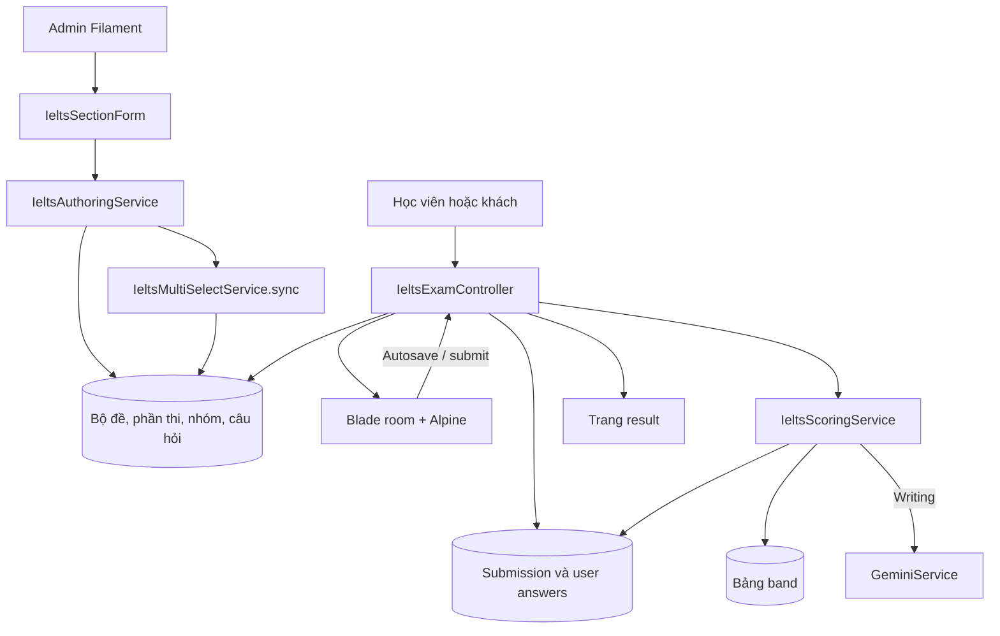
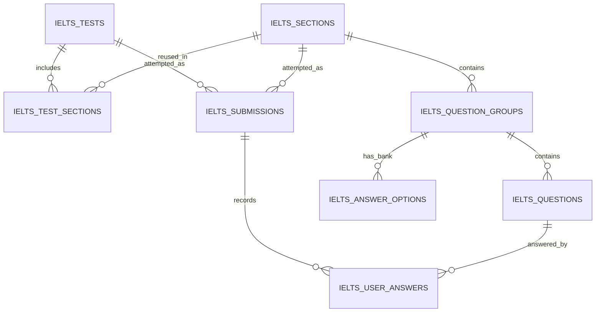

# IELTS Simulator

Tài liệu chức năng và kỹ thuật của module giả lập thi IELTS trong Vocafy.

**Cập nhật:** 01/10/2026. **Branch:** `feature/IELTS-Simulator-System-Blueprint`. **Mốc code:** `5a2740e` cùng thay đổi multi-select hiện có trong working tree, chưa coi là một bản phát hành đã nghiệm thu.

## Mục lục

1. [Phạm vi và trạng thái](#1-phạm-vi-và-trạng-thái)
2. [Kiến trúc và bản đồ mã nguồn](#2-kiến-trúc-và-bản-đồ-mã-nguồn)
3. [Mô hình dữ liệu](#3-mô-hình-dữ-liệu)
4. [Luồng biên tập và xuất bản](#4-luồng-biên-tập-và-xuất-bản)
5. [Luồng làm bài](#5-luồng-làm-bài)
6. [Routes và payload](#6-routes-và-payload)
7. [Chấm điểm](#7-chấm-điểm)
8. [Listening và media](#8-listening-và-media)
9. [Tương thích dữ liệu cũ](#9-tương-thích-dữ-liệu-cũ)
10. [Thiết lập và dữ liệu mẫu](#10-thiết-lập-và-dữ-liệu-mẫu)
11. [Hướng dẫn bảo trì và mở rộng](#11-hướng-dẫn-bảo-trì-và-mở-rộng)

Tài liệu đi kèm:

- **[Hướng dẫn admin](ADMIN-GUIDE.md):** tạo phần thi, nhập từng dạng, câu chọn nhiều, kéo thả, bản đồ, audio và xuất bản.
- **[Mức độ hoàn thiện](QUESTION-TYPES.md):** bảng các dạng đã đủ luồng chính, các dạng còn thiếu, bằng chứng từ code và thứ tự xử lý.

Các đường dẫn mã nguồn bên dưới tính từ root repository. Tài liệu mô tả hành vi của project, không xác nhận tính tương đương với quy trình thi hoặc tiêu chuẩn chấm chính thức của đơn vị tổ chức IELTS.

## 1. Phạm vi và trạng thái

Module hiện cung cấp:

- Quản trị bộ đề, phần thi, nhóm câu hỏi, câu hỏi và lượt thi bằng Filament.
- Trang danh sách đề, trang giới thiệu, phòng thi và trang kết quả.
- Reading: bài đọc và câu hỏi ở hai khung; nhóm theo Passage; chọn đáp án, nhập chữ, chọn nhiều và kéo thả.
- Listening: audio chung, bốn Part suy ra từ số câu, câu hỏi theo dữ liệu, transcript khi xem kết quả.
- Writing: Task, ảnh minh họa, vùng viết bài, đếm từ và tích hợp Gemini để chấm.
- Đồng hồ, cảnh báo thời gian, đánh dấu xem lại, highlight/ghi chú trên giao diện, tùy chọn hiển thị và ghi nhận đổi tab.
- Chấm Reading/Listening theo đáp án và quy đổi raw score sang band qua bảng dữ liệu.

**Giới hạn:** Speaking mới có cấu hình kỹ năng; chưa có luồng thi riêng. Một lượt thi hiện xử lý một section. Chưa có phiên full test nối nhiều kỹ năng hoặc overall band của cả bộ đề.

Dạng chọn một, chọn nhiều, TFNG và YNNG có đủ đường xử lý chính trong code. Matching, Completion, Short Answer, Drag & Drop, Map và Writing còn các khoảng trống được mô tả trong [báo cáo trạng thái](QUESTION-TYPES.md). Các thay đổi multi-select gần nhất chưa có nghiệm thu giao diện/test chuyên biệt.

## 2. Kiến trúc và bản đồ mã nguồn

### 2.1. Thành phần

Theo manifest của repository: Laravel 11, Filament 3, Blade, Alpine.js, Tailwind CSS và Vite. MySQL được cấu hình trong Docker Compose. Writing gọi `GeminiService`; Reading/Listening không cần AI để chấm đáp án.



### 2.2. Các file chính

| Nhóm | File / thư mục | Trách nhiệm |
| --- | --- | --- |
| Routes | `src/routes/web.php` | Bảy route IELTS dưới prefix `/ielts` |
| Controller | `src/app/Http/Controllers/IeltsExamController.php` | Danh sách, start, room, autosave, submit, result |
| Admin bộ đề | `src/app/Filament/Resources/IeltsTestResource.php` | Ghép section, kiểm tra hệ thi/kỹ năng, xuất bản |
| Admin phần thi | `src/app/Filament/Resources/IeltsSectionResource.php` | CRUD phần thi, dùng form chung |
| Form chung | `src/app/Filament/Forms/IeltsSectionForm.php` | Editor group/câu hỏi, ngân hàng, multi-select, audio |
| Admin kết quả | `src/app/Filament/Resources/IeltsSubmissionResource.php` | Danh sách lượt thi, sửa điểm/trạng thái/nhận xét, mở bài làm |
| Authoring | `src/app/Services/IeltsAuthoringService.php` | Validation nhóm, tạo dãy câu/blank, đồng bộ tổng câu và thứ tự kỹ năng |
| Multi-select | `src/app/Services/IeltsMultiSelectService.php` | Nhận dạng nhóm, chuyển dữ liệu cũ sang editor, sinh số câu, kiểm tra đáp án |
| Scoring | `src/app/Services/IeltsScoringService.php` | So khớp, raw score, band, Writing AI |
| Drag validation cũ | `src/app/Services/IeltsDragDropService.php` | Validator legacy; chưa được nối vào submit hiện tại |
| Audio | `src/app/Services/IeltsAudioService.php` | Upload, link trực tiếp, nhập Google Drive |
| Models / enums | `src/app/Models/Ielts*.php`, `src/app/Enums/Ielts*.php` | Quan hệ, casts, kỹ năng, dạng câu, trạng thái |
| Views | `src/resources/views/ielts/{index,show,room,result}.blade.php` | Giao diện học viên |
| Partial tương tác | `src/resources/views/ielts/partials/` | Multi-choice bank, drag bank, note, map, question targets |
| Migrations | `src/database/migrations/*ielts*` | Schema của module |
| Dữ liệu mẫu | `src/database/seeders/IeltsSeeder.php`, `IeltsReadingImportSeeder.php` | Bảng band, các bộ demo |
| Test hiện có | `src/tests/Feature/IeltsReadingListeningTest.php` | Ba test về matching và luồng Reading/Listening |

## 3. Mô hình dữ liệu

### 3.1. Quan hệ



### 3.2. Bảng và trường quan trọng

| Bảng | Trường chính | Ghi chú |
| --- | --- | --- |
| `ielts_tests` | `title`, `slug`, `type`, `description`, `duration_minutes`, `is_published`, `total_questions` | Bộ đề ghép một hoặc nhiều kỹ năng; slug unique |
| `ielts_sections` | `title`, `skill`, `test_type`, `time_limit_minutes`, `total_questions`, `is_active` | Section được tái sử dụng trong nhiều bộ đề |
| `ielts_test_sections` | `ielts_test_id`, `ielts_section_id`, `order` | Pivot; thứ tự do authoring đồng bộ |
| `ielts_question_groups` | Section FK, `title`, `order`, `question_type`, `response_mode`, `option_usage`, `instruction`, `passage_content`, `question_content`, `audio_url`, `transcript`, `image_url`, `settings` | Một group chứa một dạng câu; Passage có thể gồm nhiều group |
| `ielts_questions` | Group FK, `question_number`, `order`, `prompt`, `options`, `correct_answer`, `points`, `word_limit`, `explanation`, `quote_reference`, `drop_x`, `drop_y` | Một row = một số câu/ô đáp án; options là JSON |
| `ielts_answer_options` | Group FK, `option_key`, `label`, `order` | Ngân hàng quan hệ; unique group + option key |
| `ielts_submissions` | UUID, User/Test/Section FK, `skill`, `test_type`, `status`, timestamps, raw/band score, `total_questions`, `metadata`, `examiner_notes` | Một lượt thi của một section; user có thể null |
| `ielts_user_answers` | Submission FK, Question FK, `user_answer`, `is_correct`, `is_flagged_for_review`, `notes`, `time_spent_seconds` | Unique submission + question; answer đang là chuỗi, không phải mảng |
| `ielts_band_scores` | `skill`, `test_type`, `raw_score`, `band_score` | Bảng quy đổi; unique skill + type + raw |

`question_number` là số hiển thị trong toàn section. `id` là khóa database dùng khi lưu bài. Ví dụ câu số 7 có thể có ID 107; API dùng 107.

Admin hiện giới hạn số câu nhập trong khoảng 1–200 và kiểm tra trùng giữa các group. Không có unique constraint theo toàn section ở database; đường import/script phải tự áp dụng quy tắc tương ứng. Đề có số câu không liên tục vẫn có thể gặp vấn đề ở điều hướng vốn duyệt `1..total_questions`.

### 3.3. Type và cách trả lời

- `question_type`: `multiple_choice`, `true_false_not_given`, `yes_no_not_given`, `matching_headings`, `matching_information`, `fill_in_blanks`, `map_labeling`, `short_answer`, `drag_drop` legacy.
- `response_mode`: `standard` hoặc `drag_drop`.
- `option_usage`: `repeat` hoặc `once`.
- Multi-select: `question_type = multiple_choice` và `settings.multi_select = true`; không có enum multi-select riêng.

`IeltsAuthoringService::supportsDragDrop()` cho phép kéo thả đối với matching headings/information, fill in blanks, map labeling và drag legacy.

### 3.4. Dữ liệu chọn nhiều

Ví dụ group bắt đầu tại câu 7, đúng B và D:

```json
{
  "question_type": "multiple_choice",
  "response_mode": "standard",
  "settings": {
    "multi_select": true,
    "start_number": 7,
    "prompt": "What TWO benefits will the new approach bring?",
    "options": [
      {"key": "A", "text": "Prepare before the flood"},
      {"key": "B", "text": "Stop flooding across the whole area"},
      {"key": "C", "text": "Decrease rainfall through engineering"},
      {"key": "D", "text": "Reserve water to protect downstream towns"},
      {"key": "E", "text": "Store water downstream"}
    ],
    "correct_keys": ["B", "D"],
    "selection_limit": 2,
    "explanation": "Giải thích chung cho hai lựa chọn.",
    "quote_reference": "Trích dẫn từ passage."
  }
}
```

Đây là cấu trúc cấu hình phía admin/server, **không phải payload gửi toàn bộ cho thí sinh**.

Sau khi lưu quan hệ nhóm, `syncSectionTotals()` gọi `IeltsMultiSelectService::sync()`:

1. Sinh một row câu hỏi cho mỗi correct key: câu 7/B và câu 8/D, mỗi câu `points = 1`.
2. Lặp prompt/options/lời giải vào các row để tương thích schema cũ.
3. Giữ ID của các ô đang có theo thứ tự; thêm hoặc xóa row khi số đáp án thay đổi.
4. Đồng bộ `selection_limit` với số ô và đặt response mode standard.
5. Tính lại tổng câu section và các test liên quan.

Scorer gom đáp án đúng từ các row của group, không ép B vào ô 7 và D vào ô 8. Không sửa các row này độc lập khi settings multi-select là nguồn biên tập; lần đồng bộ sau sẽ áp lại settings.

## 4. Luồng biên tập và xuất bản

1. Tạo section: chọn skill/hệ thi, thời gian, trạng thái active.
2. Thêm group: đặt loại câu, instruction, passage/đề chung, options/ngân hàng, câu hỏi và đáp án.
3. Form gọi `validateGroups()` trước khi ghi quan hệ: số câu trùng, prompt, blank mapping, ngân hàng, đáp án đúng và các quy tắc multi-select.
4. Create/Edit section có database transaction; sau khi lưu gọi `syncSectionTotals()`.
5. Tạo test, chọn section cùng hệ thi. Form không cho chọn hai section cùng skill trong một test.
6. Khi xuất bản qua admin, test phải có ít nhất một section đang active và có câu hỏi.
7. `syncTestSections()` sắp thứ tự Listening → Reading → Writing → Speaking và cộng tổng câu. Thời lượng bộ đề vẫn là trường đặt riêng.

Form section cũng được dùng trong hộp thoại tạo section ngay trên test editor. Luồng modal tự lưu quan hệ và đồng bộ tổng câu trong transaction.

Hiện các kiểm tra xuất bản trên form/index chưa được áp dụng đồng nhất trong show/start. Xem mục quyền truy cập của [báo cáo trạng thái](QUESTION-TYPES.md).

## 5. Luồng làm bài

### 5.1. Bắt đầu

`start()` tìm test theo slug, chọn section theo `section_id`, tiếp đến `skill` khi không có section ID, cuối cùng rơi về section đầu nếu chưa tìm thấy.

Tạo submission UUID với user hiện tại hoặc null, section/test, skill, hệ thi lấy từ test, `in_progress`, thời điểm bắt đầu và tổng câu. Tổng câu bằng `section.total_questions`, fallback 40 nếu giá trị đó rỗng/0. Tạo sẵn user-answer rỗng cho từng câu.

Mỗi lần start tạo một submission mới. Không có logic tự tiếp tục phiên đang dở tại endpoint start.

### 5.2. Vào phòng thi

`room()` nạp section, groups, questions, answerOptions, userAnswers và user:

- Nếu đã completed: chuyển đến result.
- Tính thời gian còn lại từ `started_at` và `section.time_limit_minutes` (fallback 60 phút).
- Nếu đã hết giờ: khóa submission, chấm bài và chuyển đến result.
- Nếu chưa hết giờ: truyền các câu trả lời/flags/notes vào Alpine để khôi phục trạng thái đã lưu.

Frontend đếm ngược theo mốc `Date.now()`, có cảnh báo 10 phút/5 phút và gọi submit khi hết giờ. Save và submit chưa tự kiểm tra hạn giờ như room.

### 5.3. Phân nhóm nội dung

**Reading:** group có `passage_content` bắt đầu một Passage mới. Các group kế tiếp không có passage dùng chung nguồn cho đến group có passage tiếp theo. Group được sắp theo `order`; câu trong group theo `question_number`.

**Listening:** Part suy ra từ câu đầu group theo mỗi 10 câu, giới hạn 1–4. Vì vậy nên đặt mỗi group trọn trong một khoảng 1–10, 11–20, 21–30 hoặc 31–40.

**Writing:** giao diện dựa vào group/Task và câu của group; scorer nhận Task 1 bằng `question_number = 1`, còn câu khác được chấm theo Task 2. Nên nhập đúng hai Task với số câu 1 và 2.

Mỗi group Writing chỉ hiển thị câu đầu; đặt một câu trong mỗi group. Mốc đếm từ của renderer đang cố định 150/250 theo Task, chưa đọc `word_limit` để thay đổi mốc này.

### 5.4. Autosave

- Câu thường: gửi `question_id` và `answer` sau thay đổi; có thể gửi riêng flag hoặc notes.
- Chọn nhiều: frontend tập hợp lựa chọn và gửi group ID + mảng key. Backend phân vào các slot theo thứ tự câu, kiểm tra cả trạng thái nhóm rồi cập nhật trong transaction.
- Save khóa submission và từ chối ghi sau completed.
- Nếu lưu chọn nhiều lỗi, UI khôi phục trạng thái trước đó và báo chọn lại.
- Kéo thả chuyển ô hiện xóa nguồn rồi ghi đích qua hai lần autosave; chưa nguyên tử ở cấp thao tác chuyển.

### 5.5. Nộp bài và kết quả

Submit nhận map câu trả lời cuối cùng; khóa submission, kiểm tra multi-select trước khi cập nhật, chấm điểm rồi trả URL result. Nếu submission đã completed, không chấm lại ở endpoint này.

Frontend chờ các request lưu multi-select đang chạy, giữ snapshot đáp án ở thời điểm bấm nộp, rồi gửi bài. Khi nộp lỗi, hiển thị thông báo và giữ đáp án trên màn hình.

Trang result hiển thị raw/band score, thống kê, từng đáp án, giải thích/trích dẫn; Listening có transcript và Writing có dữ liệu đánh giá AI. Với chọn nhiều, đáp án chuẩn được hiển thị như bộ key chung, không phân biệt thứ tự.

## 6. Routes và payload

Các route dưới đây là web routes, có cơ chế session/CSRF của ứng dụng. Request JSON nên gửi `Content-Type: application/json`, `Accept: application/json` và CSRF token hợp lệ. Chưa có API version riêng cho module.

| Method | URL | Route name | Mục đích |
| --- | --- | --- | --- |
| GET | `/ielts/tests` | `ielts.tests.index` | Danh sách bộ đề |
| GET | `/ielts/tests/{slug}` | `ielts.tests.show` | Giới thiệu bộ đề |
| POST | `/ielts/tests/{slug}/start` | `ielts.tests.start` | Tạo lượt thi; redirect room |
| GET | `/ielts/exam/{submission}` | `ielts.exam.room` | Phòng thi |
| POST | `/ielts/exam/{submission}/save` | `ielts.exam.save` | Autosave |
| POST | `/ielts/exam/{submission}/submit` | `ielts.exam.submit` | Nộp và chấm |
| GET | `/ielts/exam/{submission}/result` | `ielts.exam.result` | Kết quả |

### 6.1. Bắt đầu một section

```json
{"section_id": 12}
```

Có thể gửi `{"skill":"reading"}` thay thế. Section cần thuộc test đang chọn. Hiện code fallback về section đầu khi lựa chọn không hợp lệ; đây là hành vi cần cải thiện, không nên dùng làm hợp đồng tích hợp lâu dài.

### 6.2. Lưu một đáp án / flag / notes

```json
{
  "question_id": 107,
  "answer": "B",
  "is_flagged": true,
  "notes": "Cần xem lại đoạn D"
}
```

- `answer` nullable string; `""` hoặc null dùng để bỏ đáp án.
- Có thể chỉ gửi `question_id` và `is_flagged` để đổi flag.
- `{"tab_switched":true}` tăng `metadata.tab_switch_count`.
- Thành công: `{"status":"success","question_id":107}`.
- Nhánh câu đơn hiện trả success ngay cả khi không tìm được user-answer tương ứng; cần cải thiện error contract.
- Notes qua API có thể lưu vào DB, nhưng popup ghi chú trên đoạn tô sáng hiện chủ yếu cập nhật DOM.

### 6.3. Lưu chọn nhiều

```json
{"multi_group_id": 25, "selected": ["D", "B"]}
```

Group phải nằm trong section và bật multi-select. Mảng rỗng là bỏ toàn bộ lựa chọn. Số key không vượt số row câu hỏi; các key phải hợp lệ và khác nhau sau chuẩn hóa.

Ví dụ response với slot IDs 107 và 108:

```json
{"status":"success","answers":{"107":"D","108":"B"}}
```

Thứ tự lưu không ảnh hưởng điểm. `validateAnswers()` cũng được dùng cho submit và khi gửi một đáp án đơn thuộc group multi-select.

### 6.4. Nộp bài

```json
{"answers":{"107":"D","108":"B","109":"TRUE","110":"water"}}
```

Mỗi key là question ID và mỗi value là string/null. Với multi-select, vẫn gửi từng slot, không gửi một mảng làm value của question ID.

```json
{"status":"success","redirect_url":"https://your-host/ielts/exam/SUBMISSION_UUID/result"}
```

Request không yêu cầu JSON sẽ nhận redirect. Validation lỗi trả 422 đối với request JSON. Lưu vào submission completed hiện trả 400; group không tồn tại trả 404.

**Giới hạn hợp đồng:** controller chưa kiểm tra chủ sở hữu lượt thi, chưa bảo vệ result trước khi hoàn tất và chưa áp dụng đủ validation cho tất cả question types. Xem báo cáo trạng thái trước khi xây integration hoặc triển khai thi có dữ liệu thật.

## 7. Chấm điểm

### 7.1. Reading và Listening

1. Nạp tất cả user answers và question/group.
2. So khớp `user_answer` với `correct_answer`.
3. Multi-select: xét key trong tập đáp án đúng của group, mỗi key đúng khác nhau được một điểm.
4. Drag `once`: cùng key bị dùng nhiều lần trong một group làm các câu dùng key lặp bị đánh sai.
5. Cập nhật `is_correct`; cộng `points` cho câu thường, một điểm cho mỗi slot multi-select đúng.
6. Tra band, ghi raw/band score, thời gian hoàn tất và status completed.

### 7.2. Đáp án thay thế của một ô

Scorer hỗ trợ:

```text
center / centre
3 | three
colour; color
["center", "the center", "centre"]
```

Một trong các cách viết đúng là đủ cho **một câu**. Không dùng định dạng này để biểu diễn “phải chọn hai đáp án”.

Chuẩn hóa hiện có gồm chữ thường, trim, khoảng trắng, dấu nháy/tiền tệ, dấu câu cuối, viết tắt T/F/NG/Y/N, so khớp không có khoảng trắng/gạch nối, và một nhánh so chuỗi chữ số dài. Vì chưa phân loại theo type, các quy tắc này còn có thể chấp nhận quá rộng.

### 7.3. Band score

`IeltsBandScore::convert()`:

1. Giới hạn raw score vào 0–40.
2. Tra đúng `skill + test_type + raw_score`.
3. Nếu không có, tra skill + raw score không phân biệt hệ thi.
4. Nếu vẫn không có, trả 0.0.

Không tự quy đổi tỷ lệ theo `total_questions`. Bài luyện 35 câu vẫn được tra raw trên thang 40; band hiển thị chưa được hiệu chỉnh theo độ dài đề. Bảng trong seeder là dữ liệu cấu hình của ứng dụng, không phải bằng chứng rằng mọi đề có cùng độ khó hoặc đã được chuẩn hóa.

### 7.4. Writing

- Gọi `GeminiService::evaluateWriting()` với prompt và essay từng câu.
- Task 1 được nhận diện bằng số câu 1; dùng `ielts_academic_task1`, còn lại `ielts_academic_task2`.
- `overallScore` được dùng làm band từng Task; evaluations được lưu vào metadata và notes của user-answer.
- Overall hiện tính `(Task1 + 2 × Task2) / 3`, làm tròn đến 0.5.
- `raw_score` của Writing là số phần tử Task score có giá trị, không phải số câu đúng trên 40.
- Chấm chạy đồng bộ trong request submit. Request hiện được bọc transaction/khóa lượt thi, nên gọi AI kéo dài cũng kéo dài transaction.
- Exception hoặc thiếu điểm có các fallback; xem báo cáo trạng thái để biết vì sao chưa thể coi Writing hoàn thiện.

Không có scorer Speaking riêng. Hiện skill khác Writing rơi vào nhánh chấm đáp án Reading/Listening; không nên xuất bản Speaking như tính năng đã hoạt động.

## 8. Listening và media

### 8.1. Nhập audio

`IeltsAudioService` hỗ trợ:

- Upload MP3/WAV/OGG/M4A, kiểm tra MIME và dung lượng tối đa 50 MB.
- Lưu trên disk `public`, đường dẫn `ielts/audio/<ULID>.<ext>`, URL `/storage/ielts/audio/...`.
- Link trực tiếp HTTP(S): kiểm tra cấu trúc URL rồi lưu URL, không tải toàn bộ file về server hoặc xác nhận chắc chắn có thể phát.
- Link Google Drive công khai: tải file về storage, kiểm tra host chuyển hướng, xác nhận tải file lớn, MIME/dung lượng; có giới hạn thời gian tải và số lần chuyển hướng.
- Admin có player nghe thử và nút bỏ chọn audio. Bỏ chọn chỉ xóa URL trong form, không phải cơ chế xóa file storage cũ.

`audio_url` tối đa 255 ký tự trong form/schema. Với link quá dài, dùng upload hoặc nhập Google Drive để có URL nội bộ ngắn.

### 8.2. Player hiện tại

Player chọn audio đầu tiên của các group, tự gọi play; nếu trình duyệt chặn autoplay, yêu cầu người dùng bấm để phát. Có âm lượng, mute, tiến độ và thông báo audio kết thúc.

Để dùng đúng khả năng hiện có, chuẩn bị **một audio cho cả section Listening**. Audio theo từng group chưa được nối thành playlist. Các giới hạn về reload, Part và 120 giây cuối được ghi tại [trạng thái Listening](QUESTION-TYPES.md#44-listening-chưa-hoàn-chỉnh-như-một-phiên-thi).

## 9. Tương thích dữ liệu cũ

### 9.1. Ngân hàng kéo thả

Renderer ưu tiên:

1. `group.answerOptions` từ bảng `ielts_answer_options`.
2. `settings.drag_options`.
3. `options` của câu đầu tiên.

Nhận diện kéo thả bằng response mode mới hoặc enum legacy `drag_drop`. `option_usage` được đọc trước `settings.drag_option_usage`; dữ liệu legacy chưa được migration đầy đủ có thể chịu default của cột mới. Khi chuyển đổi, kiểm tra lại `once/repeat` trên admin.

Migration `2026_10_01_000001_add_ielts_response_modes_and_answer_options.php` thêm các cột response mode, option usage, tọa độ và bảng bank; có logic chuyển dữ liệu kéo thả cũ. Migration tiếp theo bổ sung `question_content`.

### 9.2. Multi-select

`hydrate()` nạp prompt/options/số bắt đầu/key từ những row cũ khi mở editor. Các lời giải/trích dẫn khác nhau được ghép vào trường chung. `options()` vẫn đọc options của câu đầu nếu settings mới chưa có.

`selection_limit` legacy không phải nguồn quyết định độc lập của editor mới; số correct keys quyết định số slot sau sync, còn UI phòng thi giới hạn theo số slot đang tồn tại.

Không có migration database riêng cho thay đổi multi-select gần nhất; nó dùng settings JSON và schema câu hỏi đã có.

## 10. Thiết lập và dữ liệu mẫu

Các lệnh bên dưới là hướng dẫn, chưa được chạy trong đợt viết docs này. Chạy từ root project sau khi môi trường Docker của project đã được thiết lập theo [README gốc](../../README.md).

### 10.1. Schema và media

```bash
docker compose exec -T app php artisan migrate
docker compose exec -T app php artisan storage:link
```

`migrate` cập nhật schema; `storage:link` phục vụ audio qua `/storage`. Nếu đã có symlink phù hợp thì không cần tạo lại. URL public của ứng dụng và quyền ghi storage cần khớp môi trường triển khai.

### 10.2. Dữ liệu demo

```bash
docker compose exec -T app php artisan db:seed --class=IeltsSeeder
docker compose exec -T app php artisan db:seed --class=IeltsReadingImportSeeder
```

- `DatabaseSeeder` mặc định hiện không gọi hai seeder IELTS này.
- `IeltsSeeder` tạo bảng band và các đề demo, trong đó có slug `cambridge-ielts-18-academic-test-1` và `ielts-drag-and-drop-demo`.
- `IeltsReadingImportSeeder` tạo slug `reading-multi-select-flood-gifted-museums-qa`, ba passage và 35 câu/55 phút.
- Seeder dùng `updateOrCreate`, và một số đoạn xóa/rebuild ngân hàng/câu không còn trong bộ mẫu. Chạy lại có thể ghi đè chỉnh sửa của các bản ghi mẫu tương ứng; chỉ chạy có chủ đích trên dữ liệu demo.
- Không cần chạy lại seeder chỉ để bật renderer hoặc scorer mới cho dữ liệu đã tồn tại.

Trang thử nội dung có dạng `/ielts/tests/<slug>` trên host của ứng dụng. Tài liệu không xác nhận những bản ghi mẫu này đã tồn tại trong database hiện tại.

### 10.3. Writing AI

Cấu hình `GEMINI_API_KEY` được đọc qua `config('services.gemini.api_key')`. Không đưa giá trị key vào tài liệu hoặc dữ liệu đề. Khi thay đổi môi trường, lưu ý config cache và khả năng kết nối từ server đến dịch vụ AI.

### 10.4. Xử lý lỗi thường gặp

| Hiện tượng | Kiểm tra |
| --- | --- |
| Không thấy đề ở danh sách | `is_published`, section active, test đã ghép section chưa |
| Câu chọn nhiều hiện thành các radio riêng | Type phải là `multiple_choice` và `settings.multi_select = true`; kiểm tra code đã triển khai và cache view |
| Số câu/tổng câu chưa đúng | Kiểm tra `correct_keys`, số bắt đầu, số câu trùng; đường ghi ngoài admin có gọi đồng bộ không |
| Kéo thả không có lựa chọn | Ngân hàng quan hệ; fallback legacy; key/text có đầy đủ không |
| `[blank_N]` hiện nguyên văn | Kiểm tra response mode, vị trí nội dung, N có row câu tương ứng; standard chưa hỗ trợ blank chung đầy đủ |
| Không thấy map | Cần mode kéo thả, `image_url` truy cập được và tọa độ cho các câu |
| Audio không phát | MIME/dung lượng, symlink, link trực tiếp, quyền Drive, autoplay; dùng nghe thử admin |
| Band bằng 0 dù có điểm raw | Kiểm tra bảng `ielts_band_scores`, skill và test type |
| Band Writing vẫn có khi AI lỗi | Đây là fallback trong scorer hiện tại; xem log và trạng thái hạn chế, không coi là đánh giá AI thành công |

## 11. Hướng dẫn bảo trì và mở rộng

### 11.1. Khi thêm dạng câu mới

1. Xác định có cần question type mới hay chỉ một response mode/editor của type đã có.
2. Nếu thêm enum, cập nhật `IeltsQuestionTypeEnum` và nhãn admin.
3. Cập nhật editor, validation nhóm và cách lưu; không để UI hỗ trợ mà đường submit bỏ qua quy tắc.
4. Triển khai renderer cho cả Reading và Listening nếu dạng được dùng cho hai kỹ năng.
5. Định nghĩa chuẩn payload, bỏ chọn, điểm từng phần, trường hợp trùng, options không hợp lệ và quá giới hạn.
6. Cập nhật scorer và result để cùng hiểu một mô hình dữ liệu.
7. Ghi chiến lược tương thích dữ liệu cũ, tổng câu, số thứ tự và lịch sử submission.
8. Bổ sung kịch bản nghiệm thu khi thực hiện thay đổi; cập nhật bảng trạng thái trong docs.

### 11.2. Các bất biến cần giữ

- Một slot có một question ID, một question number và một user-answer trong một submission.
- Chọn N đáp án đúng tạo N số câu; không gom N key vào một answer string rồi cộng N điểm.
- Backend quyết định giới hạn và điểm; UI chỉ giúp thao tác.
- Hai đường autosave/submit cần cùng quy tắc validation; hiện kéo thả chưa đạt điều này.
- Đồng bộ tổng câu khi thay đổi cấu trúc câu, không suy ra tổng câu bằng số group.
- Tách bài đọc nguồn khỏi nội dung câu hỏi chung.
- Kỹ năng có trong enum chưa đồng nghĩa có renderer/scorer đã hoàn thiện.

### 11.3. Những phần chưa có trong phạm vi hiện tại

Chưa có importer tổng quát từ PDF/Word, API public có version, snapshot phiên bản đề, phiên full test nhiều kỹ năng, chấm Speaking hoặc cơ chế xác nhận đề đã đủ toàn bộ dạng câu. Ba passage được nhập bằng một seeder chuyên biệt.

Danh sách công việc và tiêu chí hoàn thành được duy trì tại [QUESTION-TYPES.md](QUESTION-TYPES.md). Khi cập nhật module, sửa đồng thời tài liệu kỹ thuật, hướng dẫn admin và trạng thái, tránh để ví dụ demo bị hiểu là chức năng hoàn chỉnh.
